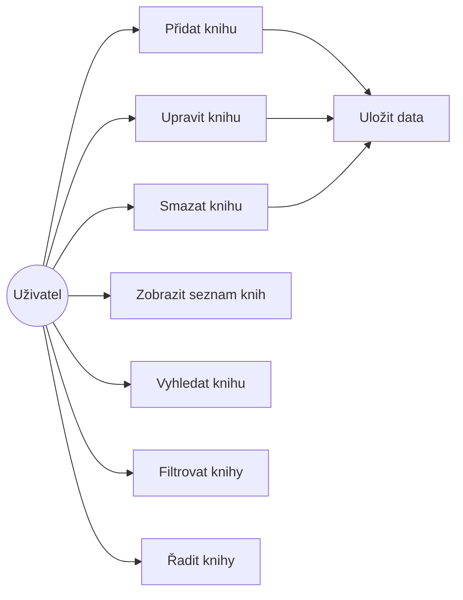
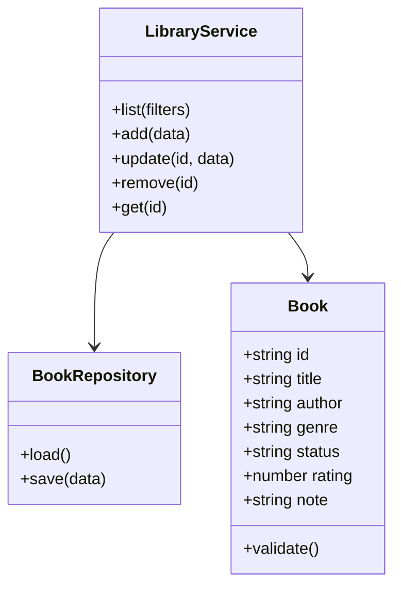

# Domácí knihovna – webová aplikace (client-side)

## 1. Funkční specifikace

### 1.1 Popis aplikace
Webová aplikace **Domácí knihovna** slouží k evidenci knih uživatele. Aplikace umožňuje přidávání, úpravu, mazání a zobrazování knih. Uživatel může knihy vyhledávat, filtrovat podle stavu a žánru a řadit podle vybraných kritérií. Data jsou ukládána lokálně na straně klienta pomocí technologie LocalStorage.

Aplikace je navržena jako single-page aplikace bez nutnosti serverové části.

---

### 1.2 Charakteristika funkčností aplikace (Use Case diagram)

---

### 1.3 Specifikace uživatelských rolí a oprávnění

Aplikace obsahuje jednu uživatelskou roli, protože nepracuje s přihlášením ani více uživateli.

| Role | Popis | Oprávnění |
|---|---|---|
| Uživatel | Běžný uživatel aplikace | Přidávání, úprava a mazání knih, vyhledávání, filtrování, řazení |

---

### 1.4 Uživatelské grafické rozhraní a funkčnosti

Aplikace je rozdělena do dvou hlavních částí:

#### Přidat / upravit knihu
Formulář obsahuje:
- Název knihy (povinné)
- Autor (povinné)
- Žánr (výběr z předdefinovaného seznamu)
- Stav (Chci / Čtu / Dočteno)
- Hodnocení (0–5)
- Poznámka

Tlačítka:
- Uložit
- Zrušit úpravu

---

#### Seznam knih
- Vyhledávání podle názvu nebo autora
- Filtrování podle stavu a žánru
- Řazení podle názvu, autora nebo hodnocení
- Zobrazení knih ve formě karet
- Barevný štítek stavu knihy
- Poznámka zobrazená kurzívou
- Tlačítka Upravit a Smazat

---

## 2. Technická specifikace

### 2.1 Datový logický model

#### Entita: Book

| Atribut | Typ | Popis |
|---|---|---|
| id | string | Unikátní identifikátor |
| title | string | Název knihy |
| author | string | Autor knihy |
| genre | string | Žánr |
| status | string | Stav knihy |
| rating | number | Hodnocení 0–5 |
| note | string | Poznámka |

Data jsou uložena v LocalStorage ve formátu JSON.

---

### 2.2 Architektura aplikace

Aplikace využívá vrstvenou architekturu:

1. Prezentační vrstva – HTML, CSS, práce s DOM
2. Servisní vrstva – aplikační logika, práce s daty
3. Datová vrstva – LocalStorage
4. Modelová vrstva – reprezentace knihy a validace dat

---

### 2.3 Popis tříd (Class diagram)

---

### 2.4 Použité technologie

- HTML5 – struktura stránky
- CSS3 – stylování a responzivní layout
- JavaScript (ES6, OOP) – aplikační logika
- LocalStorage – ukládání dat na straně klienta
- Git a GitHub – verzování projektu
- GitHub Pages – publikace aplikace

---

## 3. Odevzdání
- Markdown dokument: SPEC.md
- GitHub repozitář s projektem
- Odkaz na funkční aplikaci (GitHub Pages)
